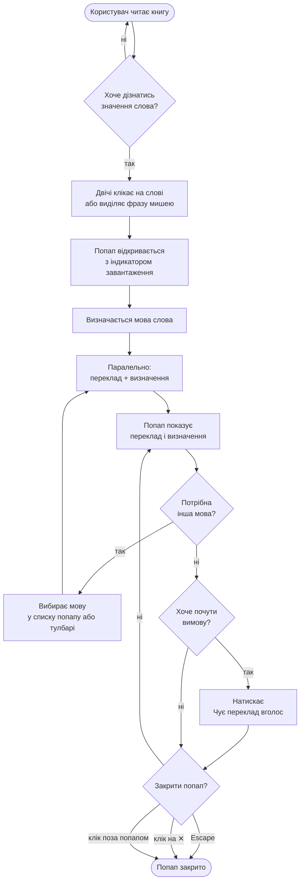

# Схема роботи модуля словника для користувача

## Як користуватись словником

---

## Покрокова інструкція

1. **Відкрийте** книгу в BookReader з увімкненим текстовим шаром.
2. **Двічі клікніть** на будь-якому слові або **виділіть фразу мишею**.
3. У спливаючому вікні з'являться **переклад** і **визначення** слова.
4. **Змініть мову** перекладу через список у попапі або у верхньому тулбарі — контент оновиться автоматично. Вибір мови зберігається між сесіями.
5. Натисніть **🎙️** щоб почути переклад вголос. Повторний клік зупиняє озвучення.
6. Закрийте попап кнопкою **✕**, кліком на затемнену підложку або клавішею **Escape**.
